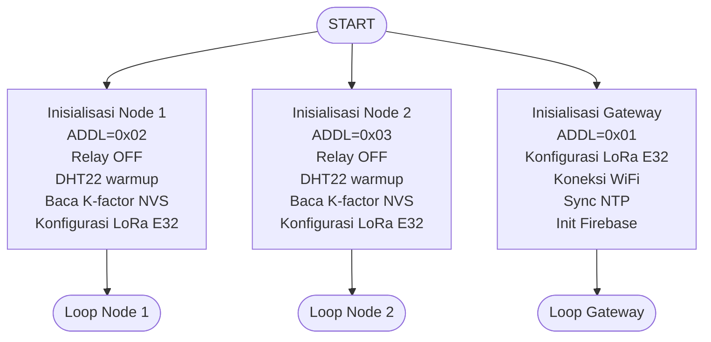
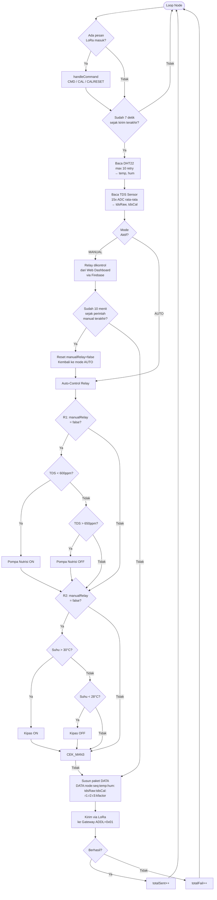
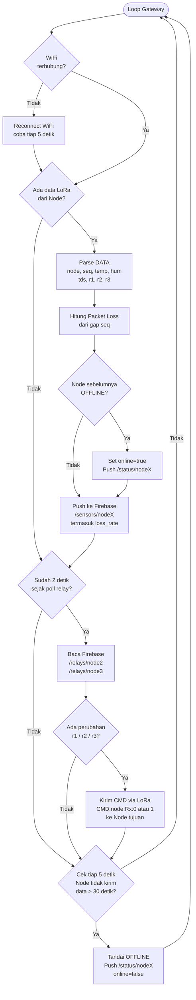
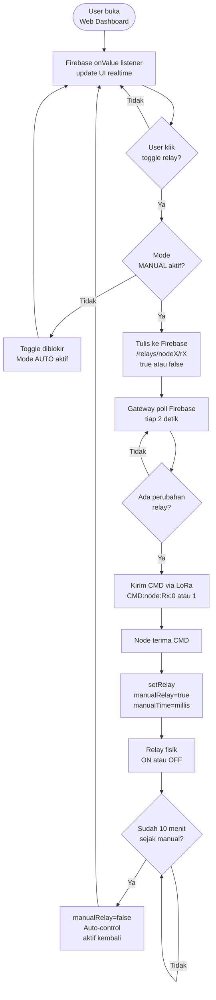
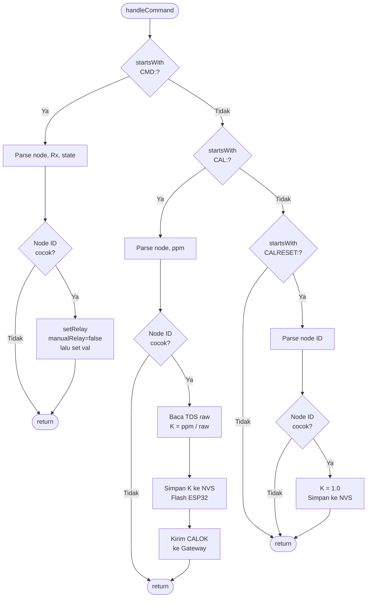

# Flowchart Sistem HydroIoT
## Format Mermaid Diagram

---

## 1. FLOWCHART UTAMA SISTEM



---

## 2. FLOWCHART LOOP NODE



---

## 3. FLOWCHART LOOP GATEWAY



---

## 4. FLOWCHART KONTROL RELAY DARI WEB



---

## 5. FLOWCHART HANDLECOMMAND NODE



---

## 6. FLOWCHART RINGKASAN SISTEM

```mermaid
flowchart LR
    subgraph NODE1[Node 1 - Hidroponik A]
        S1[DHT22\nHC-SR04\nTDS] --> AC1[Auto-Control\nRelay]
        AC1 --> TX1[Kirim DATA\nLoRa]
        RX1[Terima CMD\nLoRa] --> RL1[Pompa Air\nPompa Nutrisi\nKipas]
    end

    subgraph NODE2[Node 2 - Hidroponik B]
        S2[DHT22\nHC-SR04\nTDS] --> AC2[Auto-Control\nRelay]
        AC2 --> TX2[Kirim DATA\nLoRa]
        RX2[Terima CMD\nLoRa] --> RL2[Pompa Air\nPompa Nutrisi\nKipas]
    end

    subgraph GW[Gateway]
        LORA_RX[Terima LoRa\nHitung Loss Rate] --> FB_PUSH[Push Firebase\n/sensors/nodeX]
        FB_POLL[Poll Firebase\n/relays/nodeX] --> LORA_TX[Kirim CMD\nLoRa]
    end

    subgraph CLOUD[Firebase Realtime Database]
        DB_S[/sensors/node2\n/sensors/node3\ntermasuk loss_rate]
        DB_R[/relays/node2\n/relays/node3]
        DB_ST[/status/node2\n/status/node3]
    end

    subgraph WEB[Web Dashboard]
        MON[Monitor Sensor\nPacket Loss]
        CTRL[Kontrol Relay\nMode Auto/Manual]
    end

    TX1 -->|LoRa 433MHz| LORA_RX
    TX2 -->|LoRa 433MHz| LORA_RX
    LORA_TX -->|LoRa 433MHz| RX1
    LORA_TX -->|LoRa 433MHz| RX2

    FB_PUSH -->|WiFi| DB_S
    FB_POLL -->|WiFi| DB_R

    DB_S -->|Realtime| MON
    CTRL -->|set| DB_R
```

---

## CARA RENDER

### Mermaid Live Editor (Paling Mudah)
1. Buka [mermaid.live](https://mermaid.live)
2. Copy kode di dalam blok mermaid
3. Paste ke editor kiri → diagram muncul di kanan
4. Export PNG atau SVG untuk laporan skripsi

### VS Code
1. Install extension **Markdown Preview Mermaid Support**
2. Buka file ini
3. Tekan `Ctrl+Shift+V`
